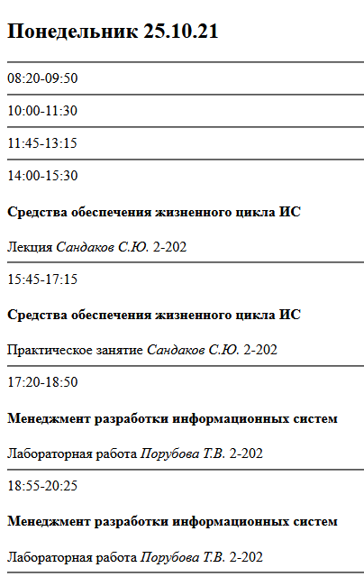

# Отчёт по лабораторной работе #1 #

**Выполнил студент ИТ-43 Лобанов Н.А., вариант 7.**

Цель: изучение методов формирования html5 документов на стороне клиента.

Задачи лабораторной работы:
1.	Организовать рабочее пространство и процессы разработки html5 документов.
2.	Изучить структуру html5 документа
3.	Исследовать функциональные возможности инструментов разработчика на стороне браузера
4.	Изучить типовые элементы структуры html5 документа
5.	Составить отчет по выполненным задачам
6.	Защитить лабораторную работу

## Ход выполнения ##
### 1 Организация рабочего пространства и процессов разработки html5 документов. ###
Для упрощения создания HTML-документов и работы в VS Code был установлен набор рекомендованных расширений:
* All Autocomplete - автозавершение ввода на основе всех открытых файлов.
* Auto Close Tag - автоматически добавляет парный закрывающий тег.
* Auto Rename Tag - автоматически редактирует парный тег.
* Path Intellisense - автозавершение путей файловой системы.
* Prettier Formatter for Visual Studio Code - автоматически форматирует код для повышения читаемости.
* vscode-multiclip - внутренний буфер обмена для хранения нескольких элементов одновременно.
* Live Server - позволяет быстро запускать сервер разработки для просмотра как статичных, так и динамических веб-страниц.
* Kite Autocomplete Plugin for Visual Studio Code - плагин автозавершения, использующий для генерации предложений машинное обучение.
* GitLens — Git supercharged - расширение, расширяющее встроенные функции работы с git в VS Code.
* Font Awesome Auto-complete & Preview - автозавершение классов иконок набора Font Awesome и их предпросмотр.
* VS Code ESLint extension - расширение для поиска, уведомления об и автоматического исправления ошибок.
* Code Runner = позволяет запускать фрагменты кода или целые файлы для различных языков.
* Bootstrap 4, Font awesome 4, Font Awesome 5 Free & Pro snippets for Visual studio code - использование готовых фрагментов кода при работе с Bootstrap и Font Awesome.
* Better Comments - расширяет функциональность комментариев, добавляя поддержку меток, меняющих цвет отображения и смысл комментария (TODO, предупреждение и т.п.)
* Visual Studio Code CSS Intellisense for HTML - автодополнение для CSS.
* Visual Studio Code HTML Snippets - расширение для поддержки работы с фрагментами кода HTML.

Установленные расширения:

Также был создан репозиторий для хранения результатов лабораторных работ в системе GitHub.

### 2 Изучение структуры html5 документа ###
В качестве иллюстрации работы HTML4 была создана страница с использованием элементов frame, которые были убраны из следующего стандарта. Главная страница index.html содержит четыре фрейма, каждый со своим содержимым и заданным расположением по отношению к другим фреймам. Затем данный код был отправлен в валидатор HTML, который автоматически проверяет файл на наличие ошибок и несоответствий заявленному стандарту.

После проверки созданной главной страницы и одной из страниц, заполняющих фрейм, были получены следующие ошибки:
* element "FRAMESET", "FRAME" undefined
* there is no attribute "ROWS", "COLS", "SRC"
* end tag for "HTML" which is not finished

Данные ошибки решились изменением HTML-декларации с определения strict на frameset, что определило элементы и атрибуты, связанные с фреймами, а также сделало тег `<html>` завершенным, так как элемент `<frameset>` заменил отсутствующий элемент `<body>`.
 
* required attribute "TYPE" not specified
* end tag for "HEAD" which is not finished

Эти ошибки решились добавлением забытого атрибута `type="text/css"` к элементу `<style>` и тега `<title>` в странице, отображаемой внутри фрейма.

После исправления данных ошибок страницы успешно прошли валидацию. Конечный внешний вид главной страницы следующий:

Затем аналогичная страница была воссоздана с использованием HTML5.

Она также прошла экспериментальную валидацию в том же сервисе:

Новый стандарт был продиктован необходимостью учесть новые тенденции в содержимом Сети, такие как появление сайтов, богатых мультимедийным контентом и веб-приложений, а также де-факто стандарты, появившиеся в результате разработки клиентского ПО, в первую очередь браузеров. В результате многие элементы, которые не использовались или же создавали проблемы при применении, были из него убраны или помечены как устаревшие. Это же относится и к некоторым атрибутам, в основном тем, которые были вытеснены CSS. В то же время было добавлено немало новых элементов. Была пересмотрена контентная модель HTML, и вместо системы block- и inline-элементов, часто неинтуитивной и вызывавшей противоречия между разными наборами правил, и даже с несвязанными определениями в CSS, были введены несколько перекрывающихся классов элементов с разным поведением. В целом изменения были нацелены на приведение стандарта к реалиям его использования, с избавлением от ненужных составляющих и включением тех, необходимость в которых была показана практикой.

Преобразование в новому стандарту в основном сводится к замене устаревших элементов новыми, либо изменением использовавшей их структуры целиком, чтобы удовлетворить новым требованиям. Среди самых очевидных изменений, затрагивающих саму основу документа, можно отметить отказ от указания в DOCTYPE типа документа, использование более простой структуры тега `<meta>` для указания кодировки документа, использование элементами `<script>` и `<style>` JavaScript и CSS по умолчанию, делая явное объявление ненужным. Также задача HTML по определению того, как отображается контент, была практически целиком переложена на CSS, что означает необходимость переосмыслить всю структуру документа.
### 3 Исследование функциональных возможностей инструментов разработчика на стороне браузера ###
Инструменты разработчика в современных браузерах позволяют получить оргомное количество информации о содержимом сайта и его интерпретации браузером, а также об используемых ресурсах. Инструменты разработчика были рассмотрены для браузеров на движке Chromium, а именно в браузере Chromium.

Инструмент, который может часто пригодиться не только разработчикам, но и посетителям сайтов - Elements. Он позволяет просмотреть исходный код страницы, одновременно выделяя элементы в фокусе или, напротив, по щелчку на элементе находя нужный элемент; позволяет редактировать содержимое; просматривать все свойства CSS, связанные с элементом события и т.п.

Консоль позволяет увидеть различные ошибки, произошедшие при загрузке сайта или выполнении скриптов, а также исполнять код javaScript в контексте данного документа.

Вкладка Sources даёт доступ к содержимому, задействованному сайтом. такому как скрипты JavaScript, файлы CSS или картинки. Также тут можно отслеживать и управлять выполнением скриптов.

Вкладка Network предоставляет информацию о сетевой активности браузера при работе с сайтом: начало и время исполнения различных запросов и связанные с ними данные. Также она позволяет протестировать сайт с ограниченной скоростью подключения или разными значениями User agent.

Вкладка Performance даёт представление о производительности сайта, например об использовании памяти во времени.

Вкладка Memory же позволяет исследовать в деталях то, как память используется в конкретный момент времени.

Вкладка Application даёт доступ к большому количеству информации о том, как сайт или веб-приложение взаимодействуют с браузером и что делают на стороне клиента, включая размещённые файлы cookie, хранимые данные, используемых Service Workers и т.п.

Наконец, вкладка Lighthouse даёт доступ к инструменту, который позволяет протестировать сайт на основе набора критериев, выдавая оценку и пояснения о том, что могло уменьшить счёт в той или иной категории, позволяя понять, что может быть улучшено для улучшения опыта взаимодействия с сайтом.

### 4 Изучение типовых элементов структуры html5 документа ###
После изучения тегов форматирования текста, были отвечены следующие вопросы:
- В: Какие из тегов являются тегами форматирования абзацев? О: Тег p определяет абзац, теги заголовков h1-h6 фактически размещают текст в отдельном абзаце и теги br и hr способны разделить куски текста горизонтально.
- В: В чем различие тегов h? О: В размере текста, отступе вокруг него, а также смысловой нагрузке - каждый следующий уровень заголовка подразумевается вложенным в предыдущий.
- В: Для чего применяется тег code, как его использовать? О: Он применяется для выделения блоков кода, вставленных в текст, и используется путём окружения кода данным тегом.
- В: В чем различие тегов code, kbd, samp, var, pre? О: Первые три из них заставляют текст отображаться моноширинным шрифтом и отличаются лишь семантикой, var отображает текст курсивом, а pre лишь сохраняет пробельные элементы, позволяя форматировать текст внутри, использууя их.
- В: В чем отличие тегов оформления цитат и определений от тегов обычного форматирования текста? О: Они имеют особые поясняющие атрибуты.
- В: Для чего применяются теги p, br и hr? О: Для горизонтального разделения текста на параграфы.
- В: Какая разница в тегах span и p? О: Первый не отделяет текст от его окружения, в то время как второй помещает его в отдельный параграф.
- В: В чем разница между тегами b и strong? О: Второй тег, кроме форматирования текста, также придаёт ему смысловую окраску важности.

Также с помощью лишь элементов форматирования текста была создана страница двухнедельного расписания занятий. Требованиями было использование тега h4 для предмета, выделения имени преподавателя курсивом, а для ссылок использование полужирного курсива и уменьшенного текста.

